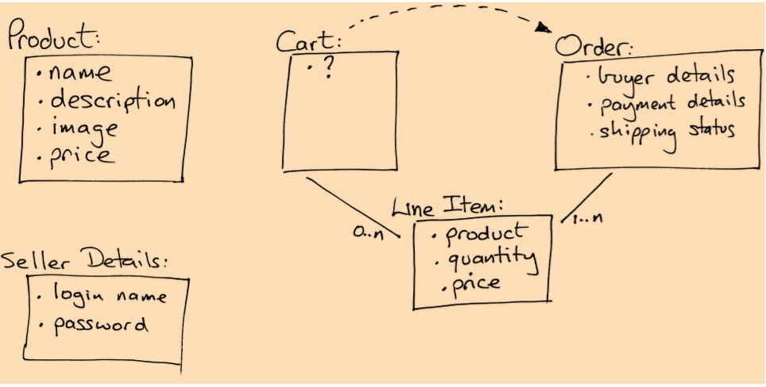

#Task G: Check Out!

## G1: Capturing an Order
依照Page.69 所規劃的示意圖，Order和LineItem要建立關聯，然後在Order裡新增訂單資訊的欄位


### 指令
`$ rails generate scaffold Order name address:text email pay_type`

`$ rails generate migration add_order_id_to_line_item order:references`

```ruby
class AddOrderToLineItems < ActiveRecord::Migration[5.0]
  def change
    add_reference :line_items, :order, foreign_key: true
  end
end
	# :references  用來參照到其他Table的外部鍵
	# t.integer :order_id
```
Reference: [iHower實戰聖經](https://ihower.tw/rails4/migrations.html)

#### belongs_to association

```ruby
# models/line_item.rb
class LineItem < ApplicationRecord
+	belongs_to :order, optional: true # remove在儲存關聯物件時會觸發驗證，預設值是false
+	belongs_to :product, optional: true
	.
end


# models/order.rb
class Order < ApplicationRecord
	.
+	has_many :line_items, dependent: :destroy
end


# models/product.rb
class Product < ApplicationRecord
	has_many :line_items
+ has_many :orders, through: :line_items
.
.(略)
# has_many :through 關聯通常用來建立兩個 Model 之間的多對多關係
# 藉由line_item裡可以找到該產品的訂單
```


Reference:
http://blog.bigbinary.com/2016/02/15/rails-5-makes-belong-to-association-required-by-default.html


### Form Helper
- Form 表單是給使用者輸入資料的地方，預設是使用 POST 方法送出資料。

- Form_for這個block，就是Rails用來產生表單的helper。

```ruby 
  # @order是實際要被編輯的物件，rails會判斷是要新增還是修改。
<%= form_for @order do |f| %> 
	<%= f.label :name, "Name:" %>
	<%= f.text_field :name, size: 40 %>
	<%= f.submit %>
<% end %>
```

```ruby
# routes.rb
Rails.application.routes.draw do
  resources :orders
  .
  .(略)
end
```
Reference: 
[RailsGuide-FormHelper](http://rails.ruby.tw/form_helpers.html)


```ruby
<div class="field">
<%= f.label :pay_type %>
<%= f.select :pay_type, Order::PAYMENT_TYPES, prompt: 'Select a payment method' %>
</div>
```
```ruby
class Order < ApplicationRecord
	PAYMENT_TYPES = [ "Check", "Credit card", "Purchase order" ]
	# 將array 賦值給PAYMENY_TYPES => Constant
	# 再用Order::PAYMENT_TYPES呼叫
end
```
常數若定義在類別中，則可以透過「類別名稱::常數」的方式取得。常數若定義在模組中，則可以透過「模組名稱::常數」的方式取得。
```
Type = "check"
Type = "cash"
warning: already initialized constant Type
warning: previous definition of Type was here
=> "cash"
```


## G2: Atom Feeds

### RSS & Atom
- RSS 一種可以把網頁最新頭條、內容或更新說明傳給眾多使用者的技術
- Atom供稿格式設計作為RSS的替代品


```
# views/products/who_bought.atom.builder
# Atom_helper
atom_feed do |feed|
	feed.title "Who bought #{@product.title}"
	feed.updated @latest_order.try(:updated_at)
	@product.orders.each do |order| 
		.
		.
		.(略)
	end 
end

```


reference: 
[Atom-wiki](https://zh.wikipedia.org/wiki/Atom_(%E6%A8%99%E6%BA%96))
					 [Atom-API](http://api.rubyonrails.org/classes/ActionView/Helpers/AtomFeedHelper.html)
					 [Atom-說明](http://emn178.pixnet.net/blog/post/83818924-atom-syndication-format(atom-feed))